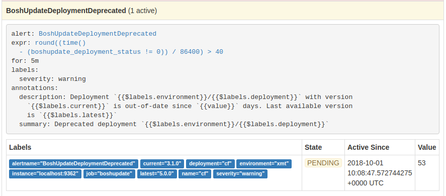
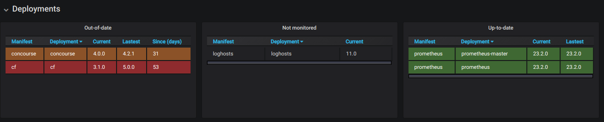
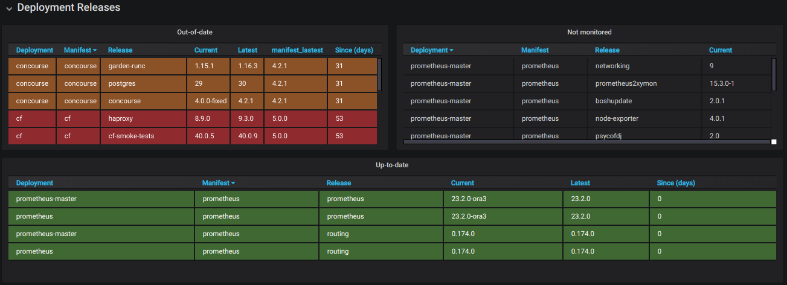
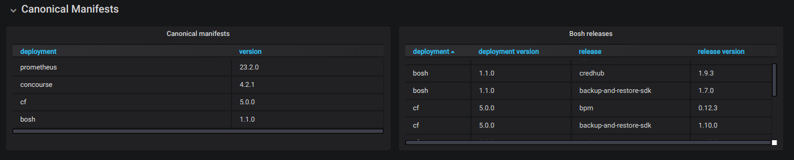

This is a [BOSH](http://bosh.io/) release for [boshupdate_exporter](https://github.com/orange-cloudfoundry/boshupdate_exporter).

## Configuration

1. Add exporter to your [prometheus](https://prometheus.io/) deployment by including
   ops file ```operators/monitor-boshupdate.yml```

2. Include dashboards with ops file ```operators/add-boshupdate-dashboards.yml```

3. Add ```manifest_version``` key to your manifests using ops file ```set-manifest-version.yml```.
   Note: not required for `cf-deployment` that already defines this key

4. Tune boshupdate_exporter providing properties according to [spec](./jobs/boshupdate_exporter/spec) and
   [exporter configuration](https://github.com/orange-cloudfoundry/boshupdate_exporter#exporter-configuration)

## Alerts



## Dashboards

### Deployments



### Deployment Bosh Releases



### Canonical Manifests



### Scrapping


<!-- Local Variables: -->
<!-- End: -->
